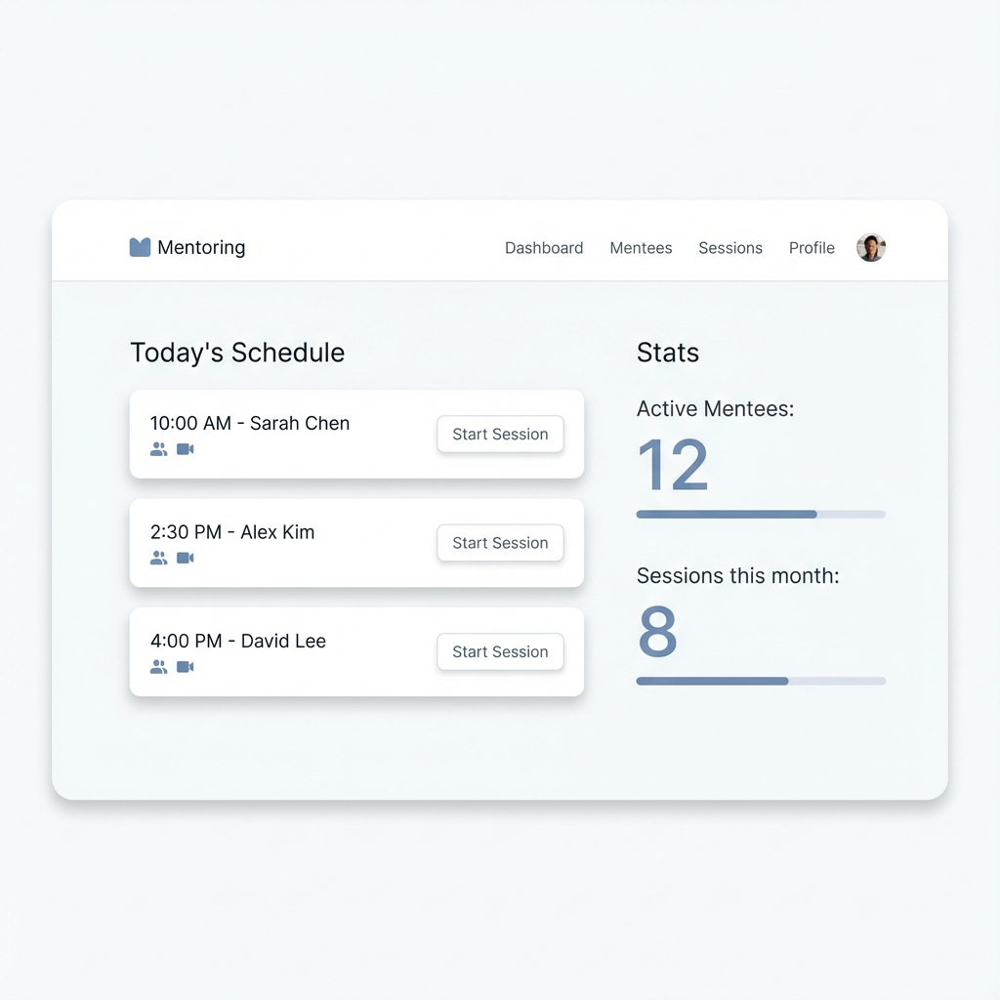
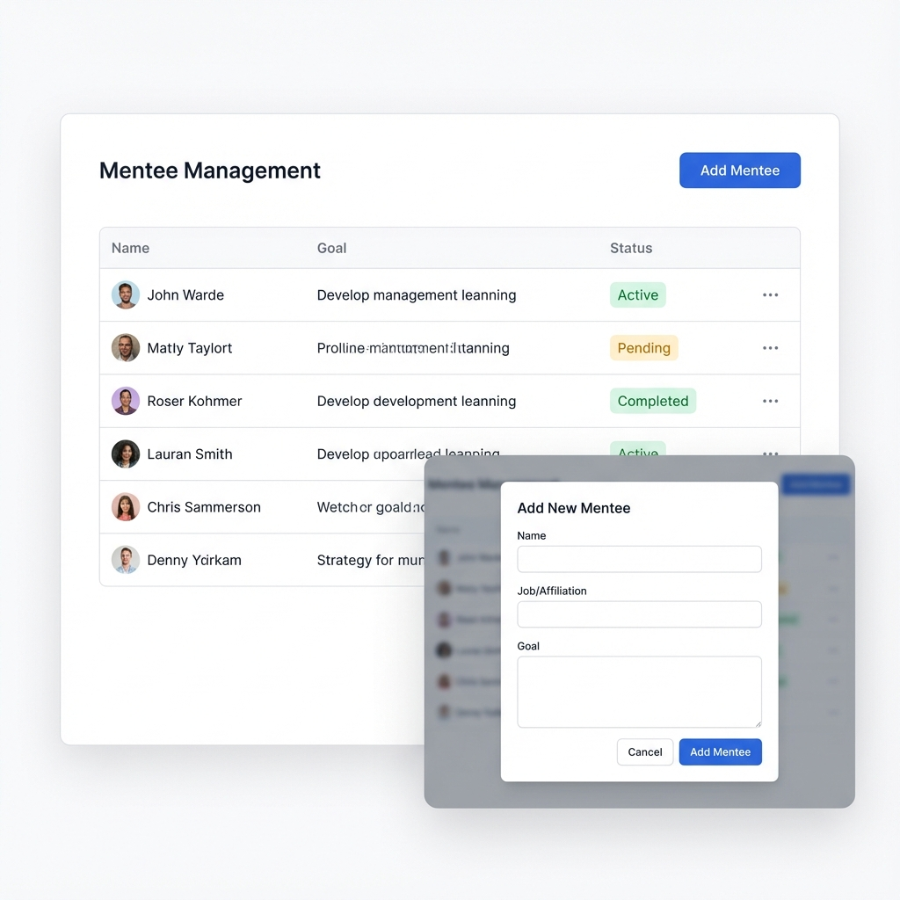
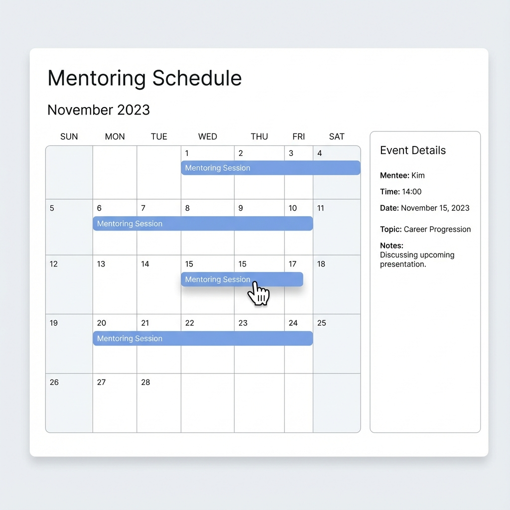

# 멘토링 시스템 사용 시나리오 및 UI 설계

## 1. 메인 대시보드 (페이지: `/`)
**시나리오**:
1. 멘토가 시스템에 접속하면 가장 먼저 대시보드를 마주합니다.
2. **상단 네비게이션**을 통해 주요 기능(대시보드, 멘티 관리, 일정 관리)으로 이동할 수 있습니다.
3. **Today's Schedule** 섹션에서 오늘 예정된 멘토링 세션을 시간순으로 확인합니다.
   - 각 카드에는 시작 시간, 멘티 이름, 화상회의 링크 아이콘, '세션 시작' 버튼이 있습니다.
4. **Stats** 섹션에서는 '활성 멘티 수', '이번 달 진행 세션 수' 등 핵심 지표를 한눈에 파악합니다.

**UI 디자인**:

- **Header**: 로고, 깔끔한 메뉴 링크.
- **Body**: 카드 UI 기반의 직관적인 레이아웃. 흰색 배경에 부드러운 그림자(Soft Shadows)를 사용하여 현대적인 느낌 강조.

---

## 2. 멘티 관리 (페이지: `/mentees`)
**시나리오**:
1. **멘티 목록 조회**: 등록된 모든 멘티를 리스트 형태로 확인합니다. 상태(Active, Pending, Completed)에 따라 배지 색상을 다르게 하여 구분을 용이하게 합니다.
2. **멘티 추가**: 우측 상단 'Add Mentee' 버튼을 클릭합니다.
   - 모달 창이 뜨고 이름, 소속, 목표를 입력합니다.
   - '저장' 버튼을 누르면 목록 최상단에 새로운 멘티가 추가됩니다.
3. **멘티 삭제/수정**: 각 행의 더보기(...) 메뉴를 통해 수정하거나 삭제할 수 있습니다.

**UI 디자인**:

- **Table/List**: 가독성을 높인 행 간격. 중요 정보(이름, 목표) 강조.
- **Modal**: 배경을 흐리게 처리(Backdrop Blur)하여 입력 폼에 집중하도록 유도.

---

## 3. 캘린더 및 일정 관리 (페이지: `/calendar`)
**시나리오**:
1. **일정 확인**: 월간 달력(Month View)에서 전체 스케줄을 조망합니다.
2. **일정 등록**: 빈 날짜를 클릭하면 일정 등록 팝업이 뜹니다. 멘티를 선택하고 시간을 설정합니다.
3. **일정 정보 확인**: 파란색으로 표시된 일정 바를 클릭하면 우측(또는 팝업)에 상세 정보(멘티, 시간, 주제, 메모)가 표시됩니다.
4. **일정 변경 (Drag & Drop)**: 일정이 변경된 경우, 해당 일정 바를 드래그하여 다른 날짜로 옮기면 즉시 반영됩니다.

**UI 디자인**:

- **Calendar**: 깔끔한 격자 레이아웃. 일정 바는 둥근 모서리와 파스텔 톤의 파란색을 사용하여 눈의 피로를 줄임.
- **Interaction**: 호버 시 시각적 피드백(커서 변경, 색상 변화) 제공.

## 4. 멘토링 일지 (기능 상세)
**시나리오**:
1. 세션이 종료된 후, 캘린더나 대시보드에서 해당 세션을 클릭합니다.
2. 상세 정보 창에서 '일지 작성' 탭으로 전환합니다.
3. 마크다운 에디터를 통해 피드백과 다음 진행 사항을 기록하고 저장합니다.
